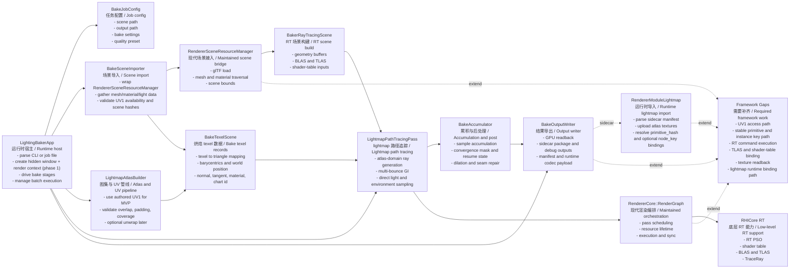

# LightingBaker Key Class Diagram / LightingBaker 关键类说明图

## Purpose / 目的

- ZH: 这份图文档用于固定 `LightingBaker` 规划中的关键模块边界，明确哪些能力复用当前维护路径，哪些能力需要为离线烘焙新增。
- EN: This diagram fixes the planned `LightingBaker` module boundaries and makes it explicit which parts reuse the maintained runtime and which parts must be added for offline baking.

## Diagram / 说明图

## Key Class Summary / 关键类摘要

| Class | ZH Responsibility | EN Responsibility | Planned Location |
| --- | --- | --- | --- |
| `LightingBakerApp` | 独立可执行程序入口，负责解析任务、创建运行时、调度整条烘焙流程。 | Standalone executable entry that parses jobs, creates the runtime, and drives the full bake flow. | `glTFRenderer/LightingBaker/App/` |
| `BakeSceneImporter` | 将 `RendererSceneResourceManager` 导出的 mesh/material/light 数据整理成 baker 使用的数据视图，并提供 scene validation hash。 | Normalizes mesh, material, and light data exported by `RendererSceneResourceManager` into baker-facing data and provides scene validation hashes. | `glTFRenderer/LightingBaker/Scene/` |
| `LightmapAtlasBuilder` | 管理 lightmap UV、chart、atlas 尺寸和 padding；MVP 优先使用作者提供的 `TEXCOORD_1`，并验证 overlap / padding / coverage。 | Manages lightmap UVs, charts, atlas sizing, and padding; MVP prefers authored `TEXCOORD_1` and validates overlap, padding, and coverage. | `glTFRenderer/LightingBaker/Bake/Atlas/` |
| `BakeTexelScene` | 生成按 atlas texel 排列的几何采样记录，作为路径追踪的输入域。 | Builds atlas-ordered texel records that become the input domain for path tracing. | `glTFRenderer/LightingBaker/Bake/Scene/` |
| `BakerRayTracingScene` | 基于现代场景数据构建 BLAS/TLAS、材质表和 shader table 依赖。 | Builds BLAS/TLAS, material tables, and shader-table dependencies from maintained scene data. | `glTFRenderer/LightingBaker/Bake/RT/` |
| `LightmapPathTracingPass` | 在 atlas 域上做 raygen，而不是在屏幕域上做 camera raygen。 | Runs ray generation in atlas space instead of screen-space camera rays. | `glTFRenderer/LightingBaker/Bake/Passes/` |
| `BakeAccumulator` | 负责多样本累积、收敛判断、pause / resume 状态、空洞扩张与 seam 修补；当前已承载 DXR dispatch readback 后的 progressive radiance accumulation。 | Owns multi-sample accumulation, convergence checks, pause/resume state, dilation, and seam repair; it currently accumulates progressive radiance read back from the DXR dispatch. | `glTFRenderer/LightingBaker/Bake/Post/` |
| `BakeOutputWriter` | 提供 readback、sidecar 发布包写出、runtime codec 产物和 manifest。 | Provides GPU readback, sidecar package export, runtime codec payloads, and manifests. | `glTFRenderer/LightingBaker/Output/` |
| `RendererModuleLightmap` | 运行时读取 sidecar manifest，上传 atlas，并以稳定键 `primitive_hash` / `node_key` 建立 lightmap binding。 | Loads the sidecar manifest at runtime, uploads atlas textures, and resolves lightmap bindings through stable `primitive_hash` / `node_key` keys. | `glTFRenderer/RendererDemo/RendererModule/` |
| `RendererSceneResourceManager` | 当前维护路径中的场景导入桥，后续需要扩展 UV1 导出。 | The maintained scene-ingest bridge; it needs UV1 export extensions. | `glTFRenderer/RendererCore/Public/RendererInterface.h`, `glTFRenderer/RendererCore/Private/RendererInterface.cpp` |
| `RenderGraph` | 当前维护路径中的现代执行骨架，后续需要补齐 RT command 执行。 | The maintained execution backbone; it needs actual RT command execution. | `glTFRenderer/RendererCore/Public/RendererInterface.h`, `glTFRenderer/RendererCore/Private/RendererInterface.cpp` |

## Current Status / 当前状态

- ZH: 当前可运行的最小链路已经覆盖 `BakeSceneImporter -> LightmapAtlasBuilder -> BakeAccumulator -> BakeOutputWriter -> RendererModuleLightmap`。其中 DXR atlas-domain dispatch 已经输出真实 radiance，`BakeAccumulator` 会对 readback 结果做 progressive accumulation，并维持 cache / sidecar package / runtime import 合同。
- EN: The current runnable minimum path already covers `BakeSceneImporter -> LightmapAtlasBuilder -> BakeAccumulator -> BakeOutputWriter -> RendererModuleLightmap`. The atlas-domain DXR dispatch now outputs real radiance, and `BakeAccumulator` progressively accumulates the readback while preserving the cache / sidecar package / runtime import contract.
- ZH: 当前 `LightmapPathTracingPass` 已经具备 factor 材质、`baseColorTexture` 和 `emissiveTexture` 的最小 diffuse path tracing 能力，后续继续补 alpha mask、direct lighting 和更高质量采样策略。
- EN: The current `LightmapPathTracingPass` already supports a minimum diffuse path tracing path with factor materials, `baseColorTexture`, and `emissiveTexture`; the next work is alpha-mask visibility, direct lighting, and higher-quality sampling strategies.

## Reference Policy / 引用方式

- ZH: `LightingBaker` 的架构设计、阶段计划和实现说明应优先引用这份说明图，而不是在每份文档里重复维护一套类依赖图。
- EN: `LightingBaker` design, planning, and implementation notes should reference this shared diagram instead of maintaining separate copies of the dependency graph.
