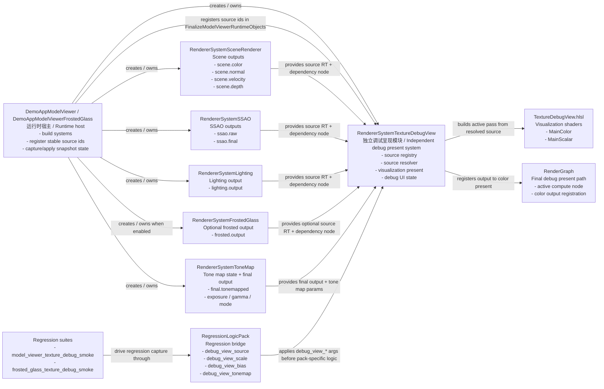

# RendererDemo Texture Debug View Diagram / Texture Debug View 关键依赖图

## Purpose / 目的

- ZH: 这份图说明 `RendererSystemTextureDebugView` 在 `RendererDemo` 维护路径中的依赖关系、注册入口和回归接入点，供使用文档与后续 feature 扩展统一引用。
- EN: This diagram captures how `RendererSystemTextureDebugView` fits into the maintained `RendererDemo` path, including source registration, runtime dependencies, and regression entry points.

## Diagram / 说明图

## Key Class Summary / 关键类摘要

| Class / File | ZH Responsibility | EN Responsibility |
| --- | --- | --- |
| `DemoAppModelViewer` | 创建 `ToneMap` 与 `TextureDebugView`，注册稳定 `source id`，并把 `tonemap` / `texture_debug` 状态纳入 snapshot。 | Creates `ToneMap` and `TextureDebugView`, registers stable `source id` values, and stores `tonemap` / `texture_debug` in snapshots. |
| `RendererSystemTextureDebugView` | 维护 source 注册表、source 解析、调试 UI、active pass node 同步以及最终调试图像输出。 | Owns the source registry, source resolution, debug UI, active-pass synchronization, and final debug image output. |
| `RendererSystemToneMap` | 只负责 tone mapping 本职，并向 `TextureDebugView` 提供最终 tonemapped 输出和 tone map 参数。 | Stays focused on tone mapping while exposing the final tonemapped output and tone-map parameters to `TextureDebugView`. |
| `RendererSystemSceneRenderer` | 提供场景基础输出，作为颜色、法线、速度、深度等 debug source 的上游。 | Provides base scene outputs used as upstream debug sources for color, normal, velocity, and depth. |
| `RendererSystemSSAO` | 提供 `ssao.raw` 与 `ssao.final`，用于 AO 调试和 regression capture。 | Provides `ssao.raw` and `ssao.final` for AO debugging and regression capture. |
| `RendererSystemLighting` | 提供 HDR lighting 输出，通常配合 `debug_view_tonemap=true` 观察。 | Provides HDR lighting output, usually viewed with `debug_view_tonemap=true`. |
| `RendererSystemFrostedGlass` | 在 frosted demo 中提供活动输出和 dependency node，供 `frosted.output` 使用。 | Exposes the active frosted output and dependency node for `frosted.output` in the frosted demo. |
| `RegressionLogicPack` | 把 suite `logic_args` 中的 `debug_view_*` 通用参数翻译成 `TextureDebugView` 状态。 | Translates suite-level `debug_view_*` arguments into `TextureDebugView` state. |

## Reference Policy / 引用方式

- ZH: `TextureDebugView` 的设计、使用、回归说明文档应优先引用这份共享依赖图，而不是重复维护同一套类关系和 source 流向。
- EN: Design, usage, and regression docs for `TextureDebugView` should reference this shared diagram instead of duplicating the same dependency graph and source flow.
