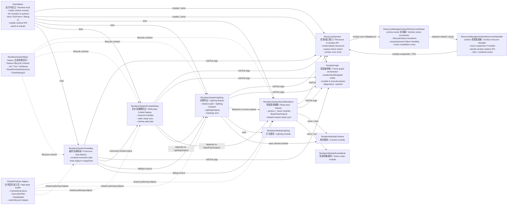

# Renderer Framework Key Class Diagram / 渲染框架关键类说明图

## Purpose / 目的

- ZH: 这份图文档作为当前 `RendererDemo` 维护路径的关键类依赖总览，用来给架构文档和应用层封装文档提供统一引用入口。
- EN: This diagram document is the shared class-dependency overview for the maintained `RendererDemo` path and is intended to be referenced by architecture and app-layer toolkit docs.

## Diagram / 说明图

## Key Class Summary / 关键类摘要

| Class | ZH Responsibility | EN Responsibility | Key Files |
| --- | --- | --- | --- |
| `DemoBase` | 统一管理运行时上下文、模块/系统初始化、主循环、Debug UI、RHI 切换与重建后的恢复。 | Owns runtime context, module/system initialization, main loop, debug UI, runtime RHI switching, and post-recreate recovery. | `glTFRenderer/RendererDemo/DemoApps/DemoBase.h`, `glTFRenderer/RendererDemo/DemoApps/DemoBase.cpp` |
| `ResourceOperator` | 暴露资源创建、上传、窗口尺寸、surface 同步等宿主侧资源接口。 | Exposes resource creation, upload, frame extent, and surface-sync APIs to features. | `glTFRenderer/RendererCore/Public/RendererInterface.h` |
| `RenderGraph` | 承担 node 生命周期、依赖校验、执行计划、pass 执行和 present。 | Owns node lifecycle, dependency validation, execution planning, pass execution, and present. | `glTFRenderer/RendererCore/Public/RendererInterface.h`, `glTFRenderer/RendererCore/Private/RendererInterface.cpp` |
| `RendererSystemBase` | 为 feature system 统一定义 `Init/Tick/OnResize/ResetRuntimeResources/DrawDebugUI` 生命周期合同。 | Defines the shared feature lifecycle contract via `Init/Tick/OnResize/ResetRuntimeResources/DrawDebugUI`. | `glTFRenderer/RendererDemo/RendererSystem/RendererSystemBase.h` |
| `RenderFeature` helpers | 提供 `FrameDimensions`、execution plan、`PassBuilder`、node lifecycle helper、static setup state 等应用层工具。 | Provides `FrameDimensions`, execution plans, `PassBuilder`, node lifecycle helpers, and static-setup state for app-layer authoring. | `glTFRenderer/RendererDemo/RendererSystem/RenderPassSetupBuilder.h` |
| `ResourceManagerSurfaceResizeCoordinator` | 负责 surface resize 生命周期、失败通知与重试入口编排。 | Orchestrates surface-resize lifecycle, failure notifications, and rebuild triggering. | `glTFRenderer/RendererCore/Private/ResourceManagerSurfaceSync.h`, `glTFRenderer/RendererCore/Private/ResourceManagerSurfaceSync.cpp` |
| `ResourceManagerSurfaceResourceRebuilder` | 负责 swapchain resize / recreate 与 window-relative render target 重建。 | Performs swapchain resize/recreate and rebuilds window-relative render targets. | `glTFRenderer/RendererCore/Private/ResourceManagerSurfaceSync.h`, `glTFRenderer/RendererCore/Private/ResourceManagerSurfaceSync.cpp` |
| `RendererSystemSceneRenderer` | 维护 base pass、相机/场景模块、GBuffer 输出和 viewport 同步。 | Maintains base pass, camera/scene modules, GBuffer outputs, and viewport-aware setup sync. | `glTFRenderer/RendererDemo/RendererSystem/RendererSystemSceneRenderer.h`, `glTFRenderer/RendererDemo/RendererSystem/RendererSystemSceneRenderer.cpp` |
| `RendererSystemLighting` | 维护 shadow path、lighting compute、light topology sync 和 lighting 输出。 | Maintains shadow path, lighting compute, light-topology sync, and lighting outputs. | `glTFRenderer/RendererDemo/RendererSystem/RendererSystemLighting.h`, `glTFRenderer/RendererDemo/RendererSystem/RendererSystemLighting.cpp` |
| `RendererSystemFrostedGlass` | 维护多 pass frosted feature、resource bundle、runtime path plan、history 与静态 setup 同步。 | Maintains the multi-pass frosted feature, resource bundles, runtime path plan, history, and static setup sync. | `glTFRenderer/RendererDemo/RendererSystem/RendererSystemFrostedGlass.h`, `glTFRenderer/RendererDemo/RendererSystem/RendererSystemFrostedGlass.cpp` |
| `RendererSystemToneMap` | 维护最终 tone map compute pass 和最终输出。 | Maintains the final tone-map compute pass and final output. | `glTFRenderer/RendererDemo/RendererSystem/RendererSystemToneMap.h`, `glTFRenderer/RendererDemo/RendererSystem/RendererSystemToneMap.cpp` |

## Reference Policy / 引用方式

- ZH: 渲染架构相关文档应优先引用这份说明图，而不是在每份文档里重复维护一套类关系图。
- EN: Rendering-architecture docs should reference this shared diagram instead of maintaining separate duplicated class graphs in each document.
